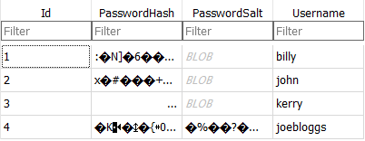
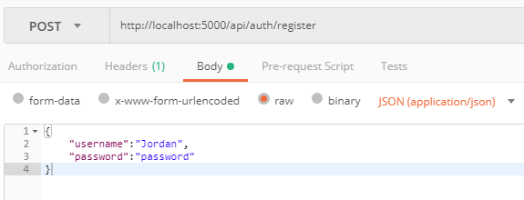
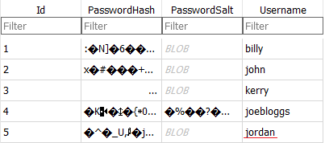

##### Users table in Sqlite

 
##### Sending JSON in POST request to register (Validation in AuthRepository)

 
##### User now added to Users table

 

All Routes defined in AuthController.  AuthController inherits from IAuthRepository which is the Interface for AuthRepository here we have all of our authentication methods

1.Register
2.Login

and other helper methods.

